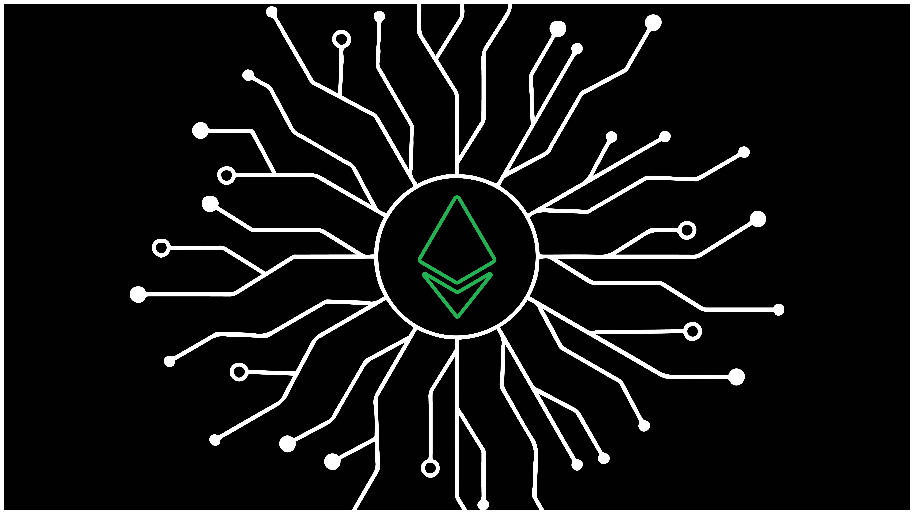
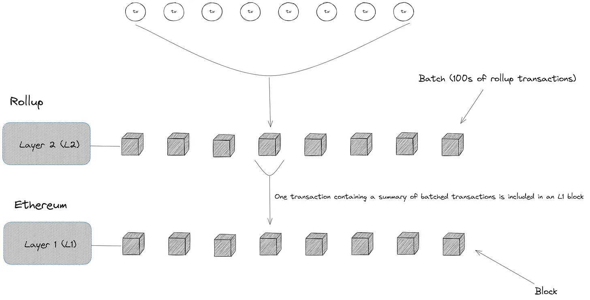
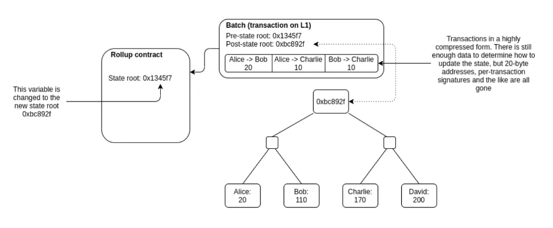
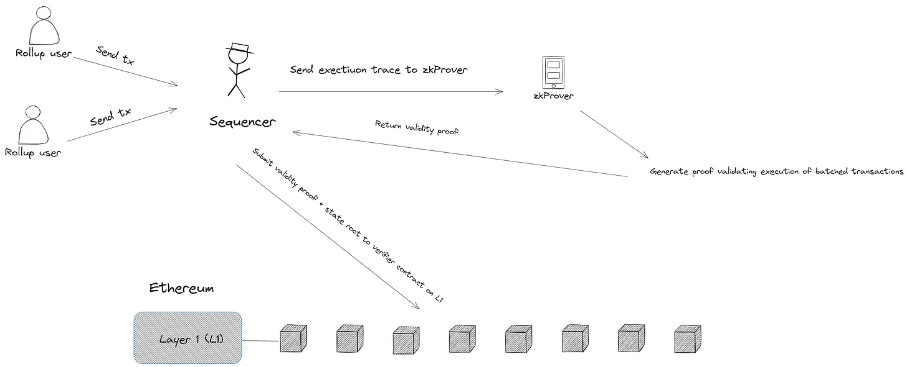
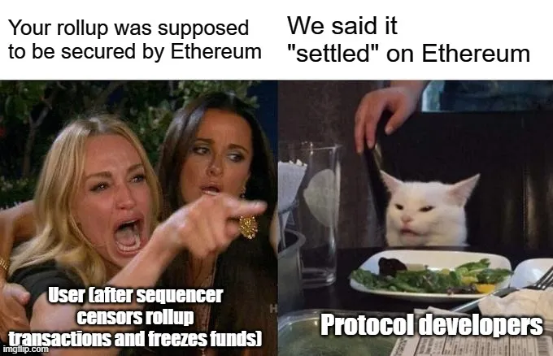
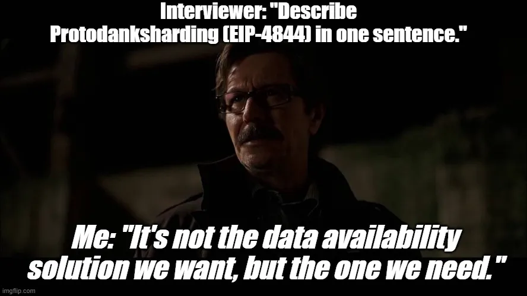
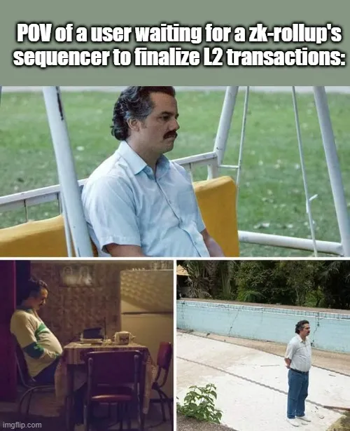

Data availability is a crucial part of the conversation around blockchain scaling: Layer 2 (L2) rollups are the preferred scaling solution for Ethereum today because availability of the L2 state is enforced by the L1 network. Even so, data availability is poorly understood—particularly in the context of rollups and other flavors of off-chain scaling.

With L2 summer finally happening after several false starts, and modular data availability layers moving from PoC (proof-of-concept) stage to production, educating the community on the implications of rollups' approach to data availability for security and decentralization has become more important than ever. It is especially important for users to know how differences in where transaction data is stored determines if a rollup is "secured by Ethereum" or not.

This article is a contribution to this effort; as the title suggests, I'll be focusing a lot on the how and why of data availability in Ethereum rollups. Data availability is a complex topic, so the article covers quite a lot of ground—but if you can bear with my (sometimes overly academic) explanations, you'll definitely find a lot of value in reading to the end.

Let's dive in!

## ELI5: What is data availability?

"Data availability" is the guarantee that the data behind a newly proposed block—which is necessary to verify the block's correctness—is available to other participants on the blockchain network. To understand why data availability is important, we must understand how blockchains work today—so here's a high-level overview:

1. Users send transactions to a **full node** that stores a local copy of the blockchain—this can be a validator, miner, or sequencer, depending on the network's design. The full node processes these transactions, creates a new block, and broadcasts it throughout the network.

2. After receiving a new block from peers, nodes download the block and re-execute transactions to confirm the block is valid according to network rules. If a newly proposed block is valid, each node will add it to its copy of the blockchain; otherwise it is discarded.

Note that each block is made up of a body (which stores a set of confirmed transactions) and a header that summarizes information about the block itself—including the timestamp, Merkle root (a cryptographic commitment to the list of transactions), block number, and nonce. By checking block headers, **light clients** (who cannot download the full block) can do things like verify the inclusion of certain transactions or check if a block belongs to the canonical chain.

## What is the data availability problem?

The data availability problem is simply asking: "How can we be sure that the data required to recreate the current state of the blockchain is available?" What we call "state" here is simply the set of information stored on-chain, such as balances of accounts, storage values of smart contracts, and the blockchain's history of transactions.

We need this data for many reasons—one being that, without it, no one would be able to verify that one or more transactions were executed correctly. And if that happens, a malicious block proposer can deceive the network about the validity of a transaction—particularly light clients that don't re-execute blocks.

A "monolithic" blockchain like Ethereum solves the data availability problem by requiring full nodes to download each block (and discard it if part of the data is unavailable). This is how "don't trust, verify" in blockchains works in practice: If, according to a new block, Alice's balance increased by 1 ETH, we don't blindly accept this as a fact. Instead, we independently verify it by re-executing the block using our local copy of the chain's state and checking if the new state matches that of the block proposer's.

But asking all nodes to download every block and re-execute transactions makes it harder to scale throughput for blockchains. If Alice sends 1 ETH to Bob in a block, a majority of the network must confirm the block before the transaction becomes final. The larger a network, the longer the delay in processing transactions—which is why Ethereum today is very slow today.

The data availability problem looks different for [modular blockchains](https://www.alchemy.com/overviews/modular-vs-monolithic-blockchains)(eg. rollups) that separate consensus from execution. For example, rollups on Ethereum process transactions on Layer 2 (L2), but publish a summary of transactions to the base layer (Layer 1) for finalization.

To clarify, a transaction is "finalized" once it becomes irreversible. In the case of an Ethereum rollup, a transaction achieves finality when the L1 block including it has been [finalized](https://info.etherscan.com/epoch-in-ethereum/)(it is approved by ⅔ of validators and cannot be reorganized), and the network has proof of the transaction's validity.

I've explained how transactions are validated on the main Ethereum chain: nodes re-execute each block to confirm its correctness. But we don't want Ethereum to download and re-execute rollup blocks before finalizing L2 transactions; that would only erode the benefit of using L2s for (off-chain) scaling. At the same time, we don't want a rollup's security to rest on the assumption that its sequencers and validators will act honestly.

Thus the data availability problem for rollups (and other off-chain scaling protocols) is proving to the base layer (L1) that data for recreating the L2 state is available without requiring L1 nodes to download blocks and store copies of the data. Data availability is necessary to guarantee a rollup's safety—that is, the property that asserts "something bad never happens" (like finalizing an invalid L2 transaction).

This is particularly important for "optimistic" rollup designs that submit transaction batches to L1 without providing a proof that confirms the validity of L2 transactions. Optimistic rollups have a 1-of-N (a.k.a., honest minority) security model that requires at least one honest node to re-execute rollup blocks and publish a [fault/fraud proof](https://academy.binance.com/en/glossary/fraud-proof)on the L1 blockchain if it detects an invalid state transition.

But checking if a particular block—and the state derived from executing the block—is valid requires access to the block's data (i.e., the set of transactions included in the block). Without access to transaction data, our friendly neighborhood watcher cannot recreate state changes and produce a fault proof that proves a particular block is invalid to the rollup's parent chain.

Zero-knowledge rollups generate validity proofs for transaction batches, which automatically guarantees safety from invalid execution, and do not suffer from a similar problem; even if a sequencer (or validator) refused to release transaction data, it cannot cause the rollup's L1 contract to accept a commitment (state root) to an invalid block. However, validity proofs cannot guarantee zk-rollup's liveness (the property that asserts "something good eventually happens") as I explained in [an old post on zkEVMs](https://linea.mirror.xyz/qD18IaQ4BROn_Y40EBMTUTdJHYghUtdECscSWyMvm8M).

* Liveness ensures anyone can read the blockchain to derive its contents—for example, to check or prove the balance of a specific address. This is important in certain cases, such as when trying to withdraw assets from a rollup's bridge contract.

* Liveness also ensures anyone can write new data to the blockchain, by processing transactions and producing blocks, especially if the rollup's sequencer is unresponsive.

Rollups go different routes when solving the data availability problem, and various design decisions have implications for security and user experience when using L2s. In subsequent sections we'll explore details of the data availability policy adopted by Ethereum rollups—that is, rollups that derive security solely from Ethereum—and then see how it compares to other alternatives.

## How do Ethereum rollups solve the data availability problem? 

Today, most rollups on Ethereum are operated by a "sequencer". The sequencer is a full node that accepts transactions from users on Layer 2 (L2), processes those transactions (using the rollup's virtual machine), and produces L2 blocks that update the state of contracts and accounts on the rollup.

Before we go any further, it's important to understand how rollups work with the base layer or "parent chain". To enable Ethereum to monitor and enforce a rollup's state transitions, a special "consensus" contract stores a [state root](https://ethereum.org/en/developers/docs/scaling/zk-rollups/#state-commitments)—a cryptographic commitment to the rollup's canonical state (similar to a block header on the L1 chain) that is generated after processing all transactions in a new batch.

<a href="https://vitalik.eth.limo/general/2021/01/05/rollup.html" target="_blank">(source)</a>

While the submission of new state roots to the L1 consensus contract is handled by a validator (who posts a bond that can be slashed if it submits a provably incorrect state root) in optimistic rollups, submitting new state roots is usually handled by the sequencer in a zk-rollup. The sequencer sends the [execution trace](https://taiko.mirror.xyz/Q0J6JmeXwTrBhK3mQRVa4NU2TzCtyDzTrjnGR8VWGOE#:~:text=When%20the%20bytecode%20is%20compiled%2C%20it%20is%20executed%20inside%20of%20the%20VM.%20That%20is%2C%20the%20VM%20takes%20a%20list%20of%20instructions%20and%20executes%20them%20one%20by%20one.%20A%20result%20of%20this%20execution%20is%20called%20%E2%80%9Cexecution%20trace.%E2%80%9D)for a batch of transactions (in addition to old and new state roots) as inputs to the zkEVM's prover and generates a proof that the batch is valid. This proof is submitted to the L1 verifier contract along with a commitment to the new state (the state root).

Once the SNARK/STARK proof is accepted, the L1 consensus contract stores the new state root, and transactions included in the corresponding batch are finalized. You can withdraw funds from the rollup at this point (if the batch included your exit transaction) since the proof convinces the bridge contract about the final execution of your transaction.

To update the state of a validity rollup on L1, it is enough to send a valid proof—without providing information about transactions or the effects of the new state update. And although a validity proof guarantees that the rollup is always safe, it doesn't guarantee that the rollup is always live (a distinction I've explained previously). This is why zk-rollups will (ideally) put all input transaction-related data on-chain and allow anyone to trustlessly reconstruct the L2's state by downloading data stored in Ethereum blocks.

Here's a brief overview of the process works (for optimistic and validity rollups):

* At intervals, the sequencer arranges transactions into a batch—batches may span several L2 blocks, and the sequencer may [compress transaction data](https://ethresear.ch/t/rollup-diff-compression-application-level-compression-strategies-to-reduce-the-l2-data-footprint-on-l1/9975)to reduce the L1 fees
* The sequencer publishes the batch on Ethereum L1 by calling the L1 contract that stores rollup batches and passing the compressed data as **calldata**to the batch submission function (see an [example of a batch submission transaction](https://etherscan.io/tx/0x893269729c2ef10f1c76a301181563c6c43b3c5c730e6ce0ab68110af6b9be6f))

This policy is markedly different from that adopted by other (non-Ethereum or partial) rollups in the wild. For example, a "sovereign" rollup might use a bespoke data availability layer to store transaction batches instead of publishing transaction data (inputs or outputs) to Ethereum. It could also post validity proofs or fault proofs—depending on the proof system in question—to the external data availability layer instead of publishing them on Ethereum) and have its full nodes download and verify those proofs to settle transactions.

Posting transaction data on Ethereum is a design decision Ethereum L2s (a.k.a., "full rollups") will make because it offers significant benefits and aligns with Ethereum's ethos of decentralization and trustlessness. But then,[policy debates shouldn't appear one-sided](https://www.lesswrong.com/posts/PeSzc9JTBxhaYRp9b/policy-debates-should-not-appear-one-sided)—which is why the next section attempts to compare this data availability policy to those adopted by other rollup projects.

## The case for on-chain data availability in Ethereum rollups

### Publishing data on Ethereum vs using a bespoke data availability layer 

The title of this post reflects a key aspect of the data availability policy in Ethereum rollups: submitting transaction data to Ethereum instead of using an alternative data availability layer. While other data availability layers indeed exist, Ethereum rollups will often choose Ethereum for data availability for its high level of (economic) security (among other reasons).

Amidst the growing popularity of the modular blockchain thesis, newer rollups are being designed with data availability as a plug-and-play component which—like other components of the [modular blockchain stack](https://volt.capital/blog/modular-blockchains)—can be swapped out at any time. A rollup in this scenario can choose to use one of the newer blockchains that specialize in providing rollups with data availability.

These data availability blockchains are similar to [data availability committees](https://blog.infura.io/post/solving-blockchain-scalability-with-data-availability-committees), only that they are permissionless (anyone can store data) and have stronger security guarantees (nodes performing data withholding attacks can be slashed). Below are some of the commonly cited benefits of using a non-Ethereum blockchain for data availability:

* **Lower costs**: A blockchain dedicated solely to data availability can optimize for reduced costs of storing data. In contrast, Ethereum combines execution, settlement, and data availability—meaning Ethereum rollups must compete with other L1 transactions for limited blockspace (increasing storage costs in the process).

* **Scale**: DA blockchains can scale horizontally through primitives like [data availability sampling](https://hackmd.io/@vbuterin/sharding_proposal#ELI5-data-availability-sampling), allowing execution layers to safely increase block sizes; conversely, an Ethereum rollup must constrain L2 block sizes to what can fit into an Ethereum block.

* **Sovereignty**: By downloading transaction data + proofs from the data availability layer, a sovereign rollup's nodes can verify state updates and independently determine the canonical chain. An Ethereum rollup can only fork by upgrading its smart contracts on L1 (the Ethereum network decides what the canonical chain is).

## Interlude: Understanding the relationship between data availability and consensus 

Before comparing the costs and benefits of using alternative data availability layers, it's important to note the relationship between data availability and consensus. Here's one way of explaining it:

* The data availability layer is responsible for coming to consensus on the ordering of transactions that ultimately define the rollup's chain
* Once a set of transactions have been ordered and committed to the base layer, those transactions become part of the canonical rollup chain and cannot be reversed (ie. finalized).

This relationship between data availability and consensus is necessary to guarantee other security properties in a rollup such as:

* **Censorship resistance**: No one should prevent a user from executing transactions on the blockchain, provided transactions are valid and pay the required network fee.

* **Re-org resistance**: No one should be able to arbitrarily "reorganize" a rollup's blocks (effectively rewriting the blockchain's history) to perform a double-spend, or [time bandit attack](https://www.mev.wiki/attack-examples/time-bandit-attack).

Enabling censorship resistance requires a mechanism to force the inclusion of certain transactions. For example, users could submit transactions directly to the data availability layer (if the rollup's sequencer is censoring), and the rollup will have a rule that prevents full nodes from creating valid blocks unless they include these transactions.

Re-org resistance requires the data availability blockchain to be secure enough against attempts to revert blocks on the base layer and rewrite a rollup's history of transactions. Specifically, security relies on the certainty that an attacker cannot control close to [51 percent](https://www.coindesk.com/learn/what-is-a-51-attack/) or [67 percent](https://ethereum.org/en/developers/docs/consensus-mechanisms/pos/attack-and-defense/#attackers-with-66-stake) of the network.

Resistance to censorship and reorg attacks is possible if the DA layer is secure, enough that a dishonest majority of nodes cannot seize control of the chain—and that security comes in the form of economic security. An attacker could (theoretically) discover a bug that puts consensus at risk—but examples are rare. The more immediate concern when designing a new blockchain is the cost of attacks targeted at corrupting its consensus.

Which brings us to the discussion of economic security in data availability layers.

## Why do data availability layers need economic security? 

A blockchain is economically secure if the cost of attacking it vastly outweighs the profits of doing so. This is why Bitcoin and Ethereum are considered extremely secure; an attacker who wants to either bribe miners/validators or create Sybil identities—enough to have majority control of the network—must necessarily spend (and probably lose) a ton of money in the process.

Bitcoin and Ethereum have this quality because of the value of their native tokens, although the relationship between Bitcoin's price and its security is less explicit than Ethereum's. To expand on this idea, the cost of attacking Bitcoin is the cost of computing power required to monopolize the network's [hash rate](https://www.investopedia.com/hash-rate-6746261), while the cost of attacking Ethereum's consensus is equal to the size of staked ETH an attacker needs to control a majority of [Beacon Chain validators](https://beaconcha.in/). With one unit of Ether (ETH) worth > $2K today, a would-be attacker would find it difficult from an economic standpoint to control a sizable portion of the ETH supply in circulation.

Given this explanation, it's possible to analyze the relationship between data availability, economic security, and rollup security by asking the following questions:

* How much will it cost an attacker to revert blocks on the data availability layer to prevent (honest) watcher nodes from accessing transaction data required to verify a state update and create fault proofs? **(Optimistic rollups)**
* How much will it cost an attacker to force nodes on the data availability to refuse requests for serve rollup data—for example, from users that require transaction batch data to construct Merkle proofs for proving inclusion of exit transactions to the bridge contract, or rollup nodes that require state data to produce new blocks? (**Validity rollups and optimistic rollups)*

In this context, using Ethereum for data availability and deriving security properties—like resistance to reorgs and safety failure—from L1 consensus offers a lot of benefit for Ethereum rollups. Can a specialized data availability layer guarantee the same level of security for rollups? That remains to be seen, but experience shows the difficulty of bootstrapping meaningful economic security for blockchains, especially when the network's native token hasn't gained significant market value.

<strong>
“But what if a DA blockchain’s token accrues enough value so that it becomes even more economically secure than Ethereum?” 
</strong>

The problem with such thinking is that it fails to realize (or acknowledge) the close relationship between utility, value, and economic security in blockchain networks. As [noted by Jon Charbonneau](https://members.delphidigital.io/reports/the-complete-guide-to-rollups/)([and others](https://bankless.ghost.io/eth-and-btc-are-economic-bandwidth/)), ETH is valuable today because its usefulness as an asset has increased over the years; and as the value of ETH increased, so did Ethereum's economic security.

With a new DA blockchain, it's usually the opposite: the native token is typically issued to allow validators to participate in Proof of Stake (PoS) consensus from the network's genesis. The expectation here is that the token's valuation will increase over time and raise the cost of an attack on the consensus layer even if the token currently has no utility beyond paying for data storage fees or staking. If the math doesn't work out for some reason—stranger things have happened in Crypto-Land—a rollup utilizing that DA layer inherits exactly zero security guarantees.

Note that this isn't a bearish take on modular data availability layers—as [other smart people have explained](https://polynya.mirror.xyz/gm6bUvvDF-sQAt7HuU6kRKCLIT9tAuaSCxHeNFdDVHk), not every blockchain app needs a high level of security that a full Ethereum rollup provides—but an attempt to clarify the security-related implications of a rollup's approach to storing transaction data. It is also an attempt to clarify that—and this is something that I expand on in the subsequent section—a rollup cannot claim to be "100% secured by Ethereum" if it's storing state data off-chain.

<strong>
“But what if a rollup settles transactions on Ethereum but posts transaction data elsewhere?” 
</strong>

By verifying proofs (validity proofs or fraud proofs) on Ethereum, a non-Ethereum rollup gains a higher degree of security than it would otherwise. For example, it becomes difficult for either the L2 nodes or the DA layer to censor proof-carrying transactions from honest nodes.

However, this doesn't solve the other problems associated with storing state data on a malfunctioning data availability layer. To illustrate, suppose a rollup deploys a smart contract on Ethereum that accepts new state roots and finalizes block headers submitted by a sequencer or validator only if it has received an attestation—asserting that the data necessary to reconstruct the rollup's state and verify the state transition is available—from the data availability layer.

In this case, a [51% or 67% attack on the data availability layer would still put the rollup network in jeopardy](https://old.reddit.com/r/ethereum/comments/rwojtk/ama_we_are_the_efs_research_team_pt_7_07_january/hrngyk8/). This is because the smart contract on Ethereum is only verifying a claim that nodes in the data availability network have attested to storing a rollup's transaction data—at the risk of getting slashed if they cannot service requests for this data—from the module connecting it to the external data availability layer. The rollup's consensus contract doesn't verify if the data is actually available as the DA attestation claims.

That opens the door for edge-cases, like a liveness failure that occurs when rollup nodes lack data to reconstruct the L2 state and produce new blocks, even though transactions are still settled on Ethereum. This reinforces the idea that using a particular blockchain for data necessarily precludes a rollup from deriving specific security guarantees from a separate blockchain.

A [data availability committee](https://blog.infura.io/post/solving-blockchain-scalability-with-data-availability-committees)(DAC) is a subtype of an external data availability layer, but I'm discussing DACs separately since they are fundamentally different from data availability networks and operate with different trust assumptions. Like a data availability network, a DAC has the core task of storing copies of off-chain data and providing it to interested parties on request.

A quorum of DAC members (usually around ¾) is required to sign an attestation confirming the availability of the data for a set of transactions that update the network's state. If the network in question is a [validium](https://ethereum.org/en/developers/docs/scaling/validium/)(validity rollup-like constructions with off-chain data availability), this attestation is either passed into a proof circuit or checked (separately) by the L1 consensus contract before accepting the validity proof for a state root submitted by the sequencer.

In an "optimium" (i.e., an optimistic rollup-like construction with off-chain data availability), the DA attestation is passed to the consensus contract before submitting a new state root. The usual flow for an optimistic rollup would involve a validator providing a hash of contents of the rollup's inbox contract that stores transaction batches (more on this later)—with optimiums, however, the L1 consensus contract only verifies that the DAC is holding the data by verifying the DA attestation.

Decentralization is the major difference between a DAC and a data availability network:

* DACs are permissioned and restricted to pre-appointed members; conversely, data availability networks are typically permissionless and allow any operator—provided they are staked on the network—to store data. (You can think of a data availability as a "permissionless DAC" for this reason.)
* While data availability networks rely on slashing for cryptoeconomic security, DAC members are usually not required to bond any collateral before assuming data storage duties; instead, security relies on the assumption that DAC nodes—who are often publicly identifiable—will act honestly to protect their reputations (i.e., social accountability).

A DAC solves the data availability problem to an extent—you've got around 7-12 nodes that promise to make transaction data available (with reputations on the line if they fail to perform duties). However, this approach doesn't achieve the same level of trustlessness and censorship resistance as a rollup that puts the data on-chain.

In optimiums, malicious DAC nodes can collude with validators and sequencers—depending on who gets to submit state roots—to finalize invalid state updates (e.g., a transaction that transfers funds out of a bridge) by performing a data withholding attack.

Validiums are secure against safety attacks from DACs with a dishonest majority, but users aren't exactly out of the woods. For instance, it is possible for a malicious DAC—whether colluding with a sequencer or not—to [freeze users' funds and censor L2 → L1 withdrawals](https://blog.matter-labs.io/zkrollup-vs-validium-starkex-5614e38bc263). As users depend on Merkle proofs (computed using data from transaction batches) to prove ownership of funds to the rollup's bridge contract, data withholding by members of the DAC would stall any attempt to withdraw funds deposited in the rollup's bridge.

**Addendum: On the security properties of modular data availability layers**

Despite my previous disclaimer, some may still feel the urge to ask: "Are you saying modular data availability layers are that insecure?" The short answer would be "No"; the longer answer would be "it's complicated". Here's a short anecdote + explanation for context:

Recently, I got talking with [Andrew](https://awmacpherson.com/)—who's a [capital R researcher](https://techcrunch.com/2022/04/21/a16z-debuts-new-crypto-research-team-led-by-columbia-stanford-researchers/), by the way—and the conversation devolved into a discussion of new data availability services appearing throughout the cryptosphere. Andrew's point?[Data availability is difficult problem to solve](https://hackmd.io/@vbuterin/sharding_proposal#Why-is-data-availability-important-and-why-is-it-hard-to-solve), especially in adversarial environments like blockchains. For example, he (rightfully) noted a node could simply pretend not to have received a client's request for a blob of data and perform a data withholding attack.

To provide some background: many data availability services rely on well-studied cryptographic primitives for security (sidenote: Ethereum's long-term solution for scaling data availability for rollups—[Danksharding](https://ethereum.org/en/roadmap/danksharding/)—relies on a similar set of primitives and makes similar security assumptions.). Below is a (non-exhaustive) list of such primitives:

* [Proofs of custody](https://ethresear.ch/t/a-0-001-bit-proof-of-custody/7409)and [proofs of retrievability](https://www.microsoft.com/en-us/research/video/compact-proofs-of-retrievability/)—which allow a client to verify that an untrusted node is storing a piece of data for an agreed period as promised.

* Data availability sampling (which I mentioned previously) ensures light clients to reliably detect unavailable blocks without downloading block contents. Combining DAS schemes with [erasure codes](https://github.com/ethereum/research/wiki/A-note-on-data-availability-and-erasure-coding#erasure-codes-as-a-solution)enable sharding data storage may also allow clients to reconstruct data blobs by asking multiple peers for pieces of the data, instead of relying on a single node, which reduces the risk of censorship and data withholding attacks.

But back to Andrew's point about censoring requests for data blobs. You might think: "Surely, a data availability protocol would have some mechanism for punishing nodes that fail to release data to clients?" That would be correct, except that implementing this mechanism isn't exactly straightforward. Specifically, as Andrew put it: "you can't punish a node for not serving up blobs based on a client's allegation."

> _"A trustless DAC [another name for a decentralized data availability service] is considered the ideal data availability solution in the blockchain community. But decentralized DACs have one fundamental issue that remains unsolved: the Fisherman's Problem. In data availability literature, The Fisherman's Problem is used to illustrate issues that appear in interactions between clients requesting data and nodes storing data in a trustless DAC protocol._
_Below is a brief description of The Fisherman's Problem:_
_Imagine a client requesting data from a node finds out parts of a block are unavailable and alerts other peers on the network. The node, however, releases the data afterwards so that other nodes find that the block's data is available upon inspection. This creates a dilemma: Was the node deliberately withholding data, or was the client raising a false alarm?"_

A description of the Fisherman’s Dilemma in a data availability protocol.<a href="https://github.com/ethereum/research/wiki/A-note-on-data-availability-and-erasure-coding" target="_blank">(source)</a>

As the infographic above shows, data unavailability is not a uniquely attributable fault; in English, that means that another node (or the protocol) cannot objectively know if the node truly refused to serve up data, or a malicious client is trying to game the system by earning rewards for false challenges. I encourage reading the previously linked articles for more background on the Fisherman's Problem; a more formal description of the problem with guaranteeing cryptoeconomic security for data availability services can be found in [this paper by Ertem Nusret Tas et al.](https://arxiv.org/abs/2208.02999)

And if solving cryptoeconomic security wasn't enough to worry about, data availability sampling—which a "decentralized data availability service" might claim is the bedrock of its security guarantees—[is still an open problem for researchers](https://github.com/ethereum/research/wiki/A-note-on-data-availability-and-erasure-coding#erasure-codes-as-a-solution). The complexity of designing modular data availability schemes is why Danksharding is expected to take years to implement and Proto-Danksharding requires all nodes to store full EIP-4844 blobs (as opposed to storing a small part and enabling clients reconstruct blobs via random sampling).

Publishing rollup data on L1 and guaranteeing persistence + availability by forcing nodes to redundantly store copies of the data isn't the most elegant solution. However, when you have the security of billions of dollars' worth of assets resting on a rollup's security (which is tightly coupled to the rollup's data availability policy), keeping it simple—until we know how to _securely_implement a better solution—is a good idea.

## Publishing raw transaction data vs publishing state diffs

Everything I've said up until now suggests publishing transaction data on Ethereum is the gold standard for Ethereum rollups. But there are different approaches an Ethereum rollup may adopt to storing state data on-chain. The differences are subtle, and may even be considered minor implementation details; however, blockchains are the one place where a cliché like "the devil is in the details" has a lot of truth to it.

A zk-rollup may opt to publish the outputs of transactions in batches posted to Ethereum L1, instead of publishing raw transaction inputs, since validity proofs attest to correct execution of batches (optimistic rollups must publish raw transaction data by default). These outputs represent the differences ("[diffs](https://en.wikipedia.org/wiki/Diff)" for short) between the rollup's old and new state between batches and will typically include information about changes in contract storage values, new contract deployments, and updates to balances of accounts involved in transactions during the sequencing timeline.

This allows a zk-rollup's sequencer to choose to either publish transaction inputs behind each state update or simply post the differences in old and new states between blocks when updating the L1's view of the rollup's state. The "state diffs" approach is unsurprisingly more popular since it decreases the rollup's on-chain footprint (less calldata consumed by batch submission transactions) and reduces operational costs for the sequencer—which in turn reduces costs passed on to users.

Publishing state diffs further supports more ways of amortizing transaction costs, which are heavily dominated by L1 calldata costs, for L2 users. For example, state diffs can omit signatures and, if many transactions in a batch/block modify the same storage slot, the batch published on-chain will only include the final update to the storage slot and leave out information about intermediate transactions.

In most cases, state diffs published on L1 are usually enough to reconstruct the rollup's state and verify blocks submitted by the rollup's sequencer (though the latter isn't strictly necessary). Nevertheless, publishing raw transaction data has some important benefits to limiting on-chain data to state outputs in some situations:

## Censorship resistance

Forcing the inclusion of transactions into a rollup by sending a transaction on L1 is the standard method of protecting users against censorship by a misbehaving sequencer. This is important, especially in cases where the sequencer is trusted (or semi-trusted) and retains the exclusive right to process rollup transactions.

A mechanism for forcing the inclusion of L1→ L2 messages is easier to implement for rollups that publish batches with full transaction data on-chain. For context, a rollup's batches are usually submitted to an "Inbox" contract on L1 that determines the canonical ordering of L2 transactions and consequently defines the rollup's state.

In the usual case, only the sequencer is allowed to submit transaction batches to the rollup's inbox—this naturally introduces a degree of centralization, but is necessary if users are to trust confirmations from the rollup's sequencer. To guarantee protection from a censoring sequencer , rollups will ideally allow a user to send a transaction to the inbox contract—with the caveat that the transaction won't be included in the inbox until the "timeout parameter" ( the delay imposed on transactions submitted to the rollup's inbox by a non-sequencer address) is exceeded.

Once the transaction makes its way into the rollup's inbox, however, it becomes a part of the canonical rollup chain. This forces the sequencer to include it in the next batch, otherwise it cannot produce a valid batch; for instance, a validity proof will reference both sequenced batches created off-chain by the sequencer _and_forced batches submitted on-chain by users. By employing the force-inclusion mechanism Ethereum rollups enable users to automatically process transactions without relying on the sequencer's honesty.

Forcing the execution of L1 → L2 transactions is more difficult if a zk-rollup publishes state diffs on-chain. In such rollups, transactions—specifically, the output of transactions—are posted to L1 _after_execution (which is primarily handled by the sequencer). This means users have no way to automatically include transactions and must rely on the cooperation of a sequencer to execute transactions that interact with a rollup's bridge contract.

To clarify, this explanation does _not_connote that every zk-rollups designed this way are susceptible to censorship. Certain zkEVM implementations have mechanisms that allow a user to post a message on L1 if they're being censored on L2. If that transaction isn't processed after a preset delay the chain enters an "emergency mode". This usually does one (or both) of the following:

* Prevents any more state updates from the trusted sequencer (whilst allowing users to withdraw assets from the rollup's bridge using Merkle proofs of ownership)
* Allows anyone (including users) to become an operator and process rollup transactions

Although these two mechanisms offer some anti-censorship protection, they are considerably less-than-ideal compared to the default approach of forcing a sequencer to execute delayed transactions; for example, the first technique (disabling state updates from a censoring sequencer) affects a rollup's liveness and doesn't assist with forcing the execution of non-withdrawal operations.

Besides, not every user will have the resources to generate validity proofs for transactions in a zk-rollup. This is why a mechanism that allows anyone to become a rollup operator—if the trusted sequencer is offline or censoring—should be the last resort, not the first line of defense against censorship on L2.

## Fast finality

It's no secret that proof generation costs are significant for zkEVM rollups—at least until innovations like parallelization or [hardware acceleration](https://www.paradigm.xyz/2022/04/zk-hardware)reduce prover costs. Verifying proofs on-chain also incurs a high fixed cost (between 500K gas and 3M gas depending on the implementation).

This forces zk-rollups to make a tradeoff when deciding how often transaction batches are published and finalized on mainnet. To illustrate, a rollup can publish transaction batches alongside validity proofs that attest to validity of batched transactions frequently (giving users fast finality on transactions), but it is expensive to create and verify proofs at a rapid pace.

The alternative is to accumulate many transactions in a batch before generating a proof and publishing the new state update on L1. Validity proofs have the nice quality of remaining roughly constant-sized, even as the data being proved grows linearly; hence, generating and verifying proofs for large batches (posted at longer intervals) reduces costs for individual transactions.

But there's a drawback: waiting for transactions to accumulate before publishing new state updates in a longer time-to-finality for rollup users. Publishing state diffs further compounds the problem: users cannot know whether a transaction was processed until a state update is published (probably hours later after sending the transaction).

Users can choose to trust "soft confirmations" from the operator (a promise to include transactions in a batch), if the rollup uses a centralized sequencer with priority access to the chain. However, a decentralized sequencer set—especially one that selects leaders randomly—will make it difficult to derive finality guarantees from soft confirmations. This would also have the effect of reducing the reliability of block explorers for end-users.

In comparison, publishing transaction inputs on-chain improves finality guarantees for users on L2. Once a new batch is posted to L1, anyone running a full node for the rollup can verify one or more transactions succeeded by executing the batch. This is still "soft finality" since a validity proof for the batch hasn't been verified, but it's usually enough for most power-users.

*Note: L2Beat has an [informative dashboard illustrating proof submission rates and finality times for validity rollups](https://l2beat.com/scaling/liveness)*

## Transaction history for dapps and infrastructure providers

A not-so-obvious consequence of publishing state diffs is that recreating a rollup's history using data from L1 becomes more difficult. For context, a validity proof only confirms that the rollup's new state is valid—but it doesn't reveal anything about the contents of the state or what transactions resulted in the new state.

And while this topic is rarely discussed, _many_applications need access to both real-time and historical blockchain data to improve overall user experience. Consider, for example, the following scenario (taken from this [great post](https://medium.com/offchainlabs/optimistic-rollups-the-present-and-future-of-ethereum-scaling-60fb9067ae87) by the Arbitrum team):

> _"Suppose that Alice submits a transaction paying Bob 1 ETH, and Bob submits a transaction paying Charlie 1 ETH, in quick succession. Later you verify a proof that Alice has 1 ETH less than before, Bob's balance hasn't changed, and Charlie has 1 ETH more than before._
_But what happened? Did Alice pay Bob? Did Bob pay Charlie? Maybe Alice paid Charlie directly. Maybe Alice burned an ETH and Charlie was paid by someone else. Maybe Diana was the intermediary, not Bob. Bob looks to the blockchain for evidence, but with some ZK-rollups that don't provide chain visibility, he can't tell the difference."_

Here, Bob can't tell how many times 1 ETH moved between accounts because the batch includes final state diffs (Alice's balance decreased by 1 ETH and Charlie's balance increased by 1 ETH) and excludes intermediary transactions (Alice sending 1 ETH to Bob). And Bob's balance doesn't change because the rollup batch conceals information about intermediate state transitions.

Bob's dilemma also reinforces a key point: many crypto applications require a complete history of transactions, not just occasional state snapshots. In more specific terms, they need to know what happened (and when) before the rollup transitioned from the previous state to the current state.

Some of these applications and services include:

* **Decentralized exchanges (DEXs)**: DEXs like Uniswap or SushiSwap often require full transaction history to track the state of liquidity pools and calculate token prices accurately based on trading volume and liquidity.

* **DeFi protocols**: Financial protocols like Aave or Compound need a complete history to calculate interest rates, loan repayments, collateral ratios, and other financial metrics. Also, they may need to audit and track transactions for regulatory compliance purposes.

* **NFT marketplaces**: These platforms might need to know the complete transaction history to verify the authenticity and provenance of the NFTs. Knowing who owned an NFT and when can greatly impact its perceived value.

* **Blockchain forensics**: Blockchain forensics services (eg. Chainalysis) provide analytics tools for transparency, anti-money laundering (AML), and know-your-customer (KYC) compliance. They use transaction histories to analyze patterns, detect suspicious activities, and trace funds.

* **Prediction markets**: Platforms like Augur may need transaction history to resolve market predictions and distribute payouts fairly and accurately.

* **Decentralized autonomous organizations (DAOs)**: DAOs may require transaction history for governance purposes, such as tracking voting on proposals.

* **Staking protocols**: These protocols require complete transaction history to calculate rewards for staking participants.

* **Cross-chain bridges**: These tools need full transaction history to ensure secure and accurate transfer of assets between different blockchains.

## Is there an ideal data availability policy for rollups? 

This article has largely focused on the benefits of rollups using Ethereum for data availability, but that doesn't mean there are no drawbacks involved. In fact, I'll be the first to admit that rollups currently [pay](https://l2fees.info/l1-fees) _ [a lot](https://l2fees.info/l1-fees)_ [to Ethereum for data availability](https://l2fees.info/l1-fees)—and since rollups aren't nonprofits, this cost is naturally passed on to users.

Still, putting (full) transaction data on-chain provides a number of advantages—many of which I've analyzed in this post. These are benefits that a _practical_chain should provide, and every rollup's data availability policy should be evaluated based on how well it guarantees those benefits for users.

Building things that work in real-world conditions requires making compromises, but a problem appears when when protocols avoid communicating the various trust assumptions that underlie the security of assets owned by users—or, worse, cut corners and dress it up under the banner of "tradeoffs" (something certain marketing teams in crypto have turned into an art ).

Besides, it may well be possible to "eat your cake and have it too" when it comes to storing rollup data on Ethereum—here are some details for context:

* Several validity (ZK) rollups are already working towards omitting signatures from transaction data, which will reduce overall on-chain footprint and bring cost savings comparable to publishing state diffs.

* [EIP-4844 (Proto-Danksharding)](https://www.eip4844.com/) will reduce costs for storing L2 data on Ethereum in the short-term by introducing data blobs and allow moderate scaling of throughput on Ethereum rollups (ballpark estimates range between 10X to 20X of current capacities).

* [Full danksharding](http://v) will reduce data availability costs even further, and improve scalability for rollups by increasing Ethereum's data bandwidth.

With these design improvements, we can get to an ideal world where [L2 transactions cost less than a few cents](https://twitter.com/VitalikButerin/status/1521501499410587653?s=20&t=U-i_dpd8G9CX21kjrFvRvg) and rollups can support high-throughput applications without reducing decentralization or security. This means that, on-chain data availability may currently be inefficient for rollups (compared to alternatives), but it'll become the most effective solution for data availability _eventually_.

As usual, I'll round off asking you to share this article if you've found it informative. You can connect with me on [Twitter/X](https://twitter.com/eawosikaa) and [LinkedIn](https://www.linkedin.com/in/emmanuelawosika/)—if only to say "came for the content; stayed for the memes." And don't forget to subscribe to Ethereum 2077 for more deep dives on all things related to Ethereum R&D.
